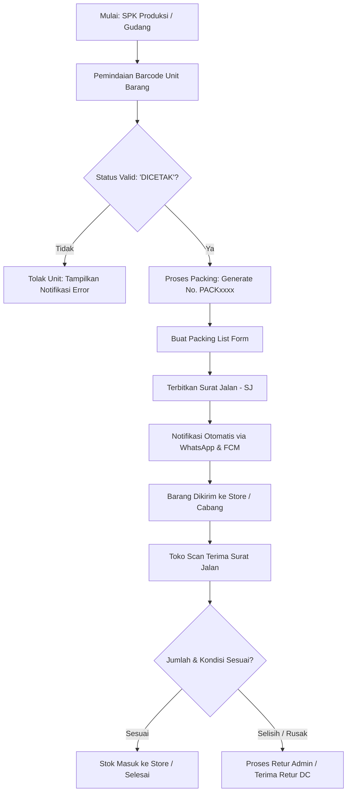
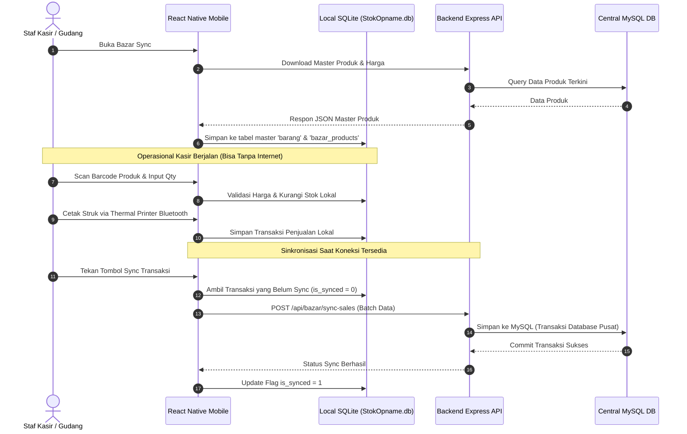

# System Design & Architecture Document (DESIGN.md)
**Project**: Sistem Operasional Packing, Logistik, Gudang & Retail (Kencana)  
**Dokumen Versi**: 1.0.0  
**Tanggal**: 2026-09-27  

---

## 1. Ringkasan Sistem (System Overview)

Sistem ini merupakan ekosistem terpadu untuk mengelola alur operasional logistik, pergudangan (Distribution Center / DC), distribusi cabang / toko (Store), hingga penjualan ritel dan bazar. Sistem terdiri dari dua komponen utama:

1. **`packing_backend`**: REST API berbasis Node.js dan Express.js yang terhubung ke database relasional MySQL, layanan push notification Firebase Cloud Messaging (FCM), serta bot pesan WhatsApp otomatis berbasis Baileys.
2. **`packing_frontend`**: Aplikasi mobile lintas platform berbasis React Native (fokus utama Android untuk perangkat scanner industri/handheld & smartphone operasional staf gudang/kasir) yang dilengkapi database lokal SQLite untuk mendukung operasional *offline-first* (seperti bazar/kasir darurat).

```
+-----------------------------------------------------------------------------------+
|                                 EKOSISTEM SISTEM                                  |
+-----------------------------------------------------------------------------------+
|                                                                                   |
|   +-----------------------+                    +------------------------------+   |
|   |   packing_frontend    |   REST API (JSON)  |       packing_backend        |   |
|   | (React Native Mobile) | <================> |      (Node.js / Express)     |   |
|   +-----------------------+                    +------------------------------+   |
|         |          |                                      |          |            |
|     (Hardware) (Offline DB)                          (Database)  (3rd Party)      |
|         |          |                                      |          |            |
|         v          v                                      v          v            |
|    - Thermal     SQLite                                 MySQL      - Firebase FCM |
|      Printer    (StokOpname.db)                       (retail /    - Baileys WA   |
|    - Barcode                                           retailnew)                 |
|      Scanner                                                                      |
+-----------------------------------------------------------------------------------+
```

---

## 2. Arsitektur Teknis (Technical Architecture)

### 2.1 Backend Architecture (`packing_backend`)
- **Runtime**: Node.js (v18+)
- **Framework**: Express.js (v5.x)
- **Database Client**: `mysql2/promise` dengan pooling terkelola (`mysql.createPool`)
- **Authentication**: JWT (JSON Web Token) dengan enkripsi password `bcrypt`
- **Process Manager**: PM2 (`ecosystem.config.js`)
- **Integrasi Pihak Ketiga**:
  - `@whiskeysockets/baileys`: Notifikasi WhatsApp otomatis dan QR linking
  - `firebase-admin`: Push notifications ke aplikasi mobile
  - `multer`: Penanganan upload file/foto dokumen operasional

#### Lingkungan Server (Environments)
Sistem dikelola melalui PM2 dengan 3 environment berbeda:
| Environment | Port | Target Database | Deskripsi |
| :--- | :--- | :--- | :--- |
| **`packing-prod`** | `3000` | `retail` | Server produksi utama untuk operasional live |
| **`packing-trial`** | `3002` | `retailnew` | Server staging/uji coba untuk simulasi data |
| **`packing-local`** | `3004` | `retailnew` | Server pengembangan lokal (developer testing) |

### 2.2 Frontend Architecture (`packing_frontend`)
- **Framework**: React Native (0.73.6)
- **Navigasi**: `@react-navigation/native` & `@react-navigation/native-stack`
- **State & Storage**:
  - `AuthContext`: Manajemen state otentikasi global, cabang aktif, token, dan biometrik
  - `@react-native-async-storage/async-storage`: Penyimpanan cache preferensi, token, dan sesi lokal
  - `react-native-sqlite-storage`: Database SQLite lokal (`StokOpname.db`) untuk mode transaksi offline bazar dan opname massal
- **Perangkat Keras & Utility**:
  - `react-native-thermal-receipt-printer-image-qr`: Pencetakan struk kasir & label thermal (ESC/POS)
  - `react-native-sound-player`: Efek audio beep validasi sukses / gagal saat pemindaian barcode
  - `react-native-geolocation-service`: Validasi radius lokasi fisik (geofencing) saat login & pemilihan cabang
  - `react-native-biometrics`: Otentikasi sidik jari / Face ID staf
  - `@react-native-firebase/messaging` + `@notifee/react-native`: Penerimaan dan penanganan push notifikasi instan

---

## 3. Diagram Alur Sistem (System Flowcharts)

### 3.1 Alur Logistik & Pergudangan (Warehouse & Logistics Flow)


### 3.2 Alur Transaksi Bazar & Kasir Offline-First


---

## 4. Modul Fungsional (Functional Modules)

### 4.1 Autentikasi & Keamanan (Authentication & Security)
- **Login Multi-Faktor**: Validasi kredensial pengguna, enkripsi kata sandi, deteksi lokasi geografis (GPS latitude/longitude) untuk mencegah presensi/login di luar area resmi.
- **Branch Selection**: User dapat bertugas pada cabang tertentu sesuai hak akses yang diberikan.
- **Device Binding & Keystore**: Integrasi biometrik perangkat untuk otentikasi cepat dan aman.
- **JWT Authorization**: Token disertakan pada setiap request header (`Authorization: Bearer <token>`).

### 4.2 Operasional Packing & Surat Jalan (Packing & Dispatch)
- **Packing (`/api/packing`)**: Pemindaian serial unit (`tbarangdc_unit`), validasi status, penggabungan ke nomor packing (`tpacking`).
- **Packing List (`/api/packing-list-form`)**: Pembuatan manifes isi packingan per tujuan cabang.
- **Surat Jalan (`/api/surat-jalan`)**: Penerbitan dokumen pengiriman resmi lengkap dengan data ekspedisi, driver, dan nomor segel.
- **Terima SJ (`/api/terima-sj`)**: Validasi penerimaan oleh cabang tujuan dengan scan barcode setiap koli/unit.

### 4.3 Retur & Kontrol Kualitas (Returns & Quality Control)
- **Checker (`/api/checker`)**: Verifikasi barang sebelum pengiriman akhir.
- **Retur Admin (`/api/retur-admin`)**: Pendaftaran barang retur dari cabang ke DC karena cacat/rusak/kelebihan.
- **Terima Retur DC (`/api/terima-retur-dc`)**: Konfirmasi penerimaan fisik barang retur di gudang pusat.
- **Lost Order (`/api/lost-order`)**: Pencatatan dan investigasi barang yang hilang dalam perjalanan atau selisih stok.

### 4.4 Manajemen Stok & Opname (Inventory & Stock Control)
- **Mobile Stok Opname (`/api/mobile/so`)**: Pendataan fisik stok per lokasi rak/zona gudang secara digital.
- **Real-Time Stock (`/api/stock`)**: Monitoring pergerakan stok, stok minimum (*low stock alerts*), dan mutasi antar cabang (`/api/mutasi-store` & `/api/mutasi-terima`).
- **Tutup Buku (`src/utils/tutupBuku.util.js`)**: Validasi pembatasan transaksi jika periode akuntansi/gudang telah dikunci (*cut-off*).

### 4.5 Kasir Bazar & Penjualan (Retail & Sales)
- **Penjualan Langsung (`/api/penjualan`)**: Modul kasir cepat di gerai toko.
- **Bazar POS (`/api/bazar`)**: Kasir khusus event bazar dengan dukungan cetak thermal ESC/POS dan sinkronisasi dua arah.
- **Invoicing (`/api/invoices`)**: Pembuatan faktur tagihan dan struk pembayaran.

### 4.6 Material Request & Buku Tamu (Production & Admin)
- **SPK (`/api/spk`)**: Surat Perintah Kerja produksi dan packing.
- **Minta Bahan & Barang (`/api/minta-bahan`, `/api/minta-barang`)**: Form permintaan material antar departemen.
- **Buku Tamu Digital (`/api/buku-tamu`)**: Pencatatan tamu/rekanan operasional gudang.

---

## 5. Standar Desain API (API Standards)

### 5.1 Format Respon Baku (JSON Response Standard)
Semua endpoint REST API wajib mengembalikan format seragam:

#### Respon Sukses:
```json
{
  "success": true,
  "message": "Data packing berhasil disimpan.",
  "data": {
    "pack_nomor": "PACK260900012",
    "total_unit": 24
  }
}
```

#### Respon Gagal:
```json
{
  "success": false,
  "message": "Unit dengan serial QR-9921 sudah dipacking sebelumnya.",
  "error": "DUPLICATE_UNIT_STATUS"
}
```

### 5.2 Status HTTP Code
- `200 OK`: Request berhasil dieksekusi.
- `201 Created`: Data baru berhasil dibuat.
- `400 Bad Request`: Validasi input gagal, stok tidak mencukupi, atau status barang tidak sesuai.
- `401 Unauthorized`: Token tidak disertakan atau token kedaluwarsa.
- `403 Forbidden`: Hak akses / role pengguna tidak mengizinkan aksi ini.
- `404 Not Found`: Data barcode / dokumen tidak ditemukan di database.
- `500 Internal Server Error`: Kesalahan sistem atau database MySQL crash.

---

## 6. Standar Database & Transaksi

1. **Transaction Wrapping**: Setiap operasi yang melibatkan mutasi lebih dari satu tabel (misal: simpan Surat Jalan + potong stok + update status unit) **wajib** menggunakan database transaction:
   ```javascript
   const connection = await pool.getConnection();
   try {
     await connection.beginTransaction();
     // Query 1, 2, 3 ...
     await connection.commit();
   } catch (error) {
     await connection.rollback();
     throw error;
   } finally {
     connection.release();
   }
   ```
2. **Parameterized Query**: Dilarang melakukan string concatenation pada query SQL untuk mencegah kerentanan SQL Injection. Selalu gunakan placeholder `?`.
3. **Konvensi Nama Tabel**: Tabel utama menggunakan prefix `t` (misal: `tpacking`, `tsuratjalan`, `tbarangdc_unit`, `tpenjualan`).
